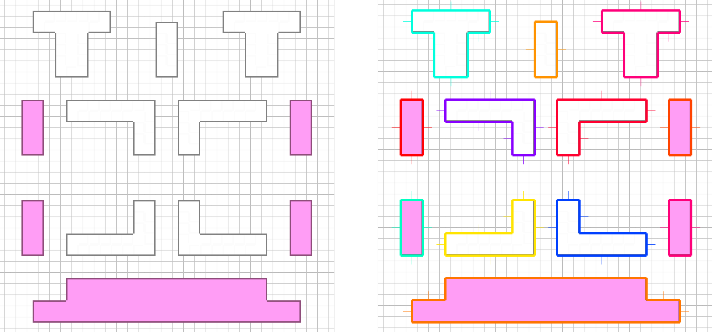

# Hulls from Tilemaps in Phaser

A module for reducing neighboring tiles (in a tilemap) into a single shape - a polygon "hull". For example, the demo tilemap (left) is converted into a series of hulls and visualized (right). The hulls contain information about the edges - including the midpoint, normal and length. See [src/js/states/start.js](https://github.com/mikewesthad/phaser-tiled-hull/blob/master/src/js/states/start.js) for example usage.



We needed the ability to find hulls in a tilemap for casting shadows in a 2D lighting engine. This hull calculation could also be useful for simplifying collision detection with a tilemap.

## Usages

Whether you include the library as a script tag or import it as a module, Phaser is a dependency. The library expects Phaser to be in the global scope.

### As a Script

Download the dist/phaser-tiled-hull.min.js [here](https://raw.githubusercontent.com/mikewesthad/phaser-tiled-hull/master/dist/phaser-tiled-hull.min.js) and include it in your HTML:

```
<script src="dist/phaser-tiled-hull.min.js><script>
```

Inside of your own script, you can now use the global `phaserTiledHull`:

```js
phaserTiledHull(...)
```

See [src/js/states/start.js](https://github.com/mikewesthad/phaser-tiled-hull/blob/master/src/js/states/start.js) for example usage in global mode.

### As a Module

Install the dependency:

```
npm install --save phaser-tiled-hull
```

To use the babelified and minified library:

```js
import phaserTiledHull from "phaser-tiled-hull";
phaserTiledHull(...)
```

To use the raw es6 library (so you can transpile it to match your own project settings):

```js
import phaserTiledHull from "phaser-tiled-hull/src/library";
phaserTiledHull(...)
```

## To Do

- Add detailed usage snippets
- Publish to npm
- Generate jsdocs
- Add Phaser as an external dependency so that it doesn't have to be on the global. Relevant mostly for when Phaser v3 is released.
- hull.js can't handle 1x tile concave gaps. Submit PR to hull.js to fix that. For example:

```
Tilemap:             Hull:

 X X X               X X X
 X          ⟶       X   X
 X X X               X X X

```

## Building Source

See the scripts section of package.json. Main commands:

```
npm run build:all   ⟶   Builds & minifies the library & example
npm run dev         ⟶   Builds the library & example and serves it via browser-sync
```

Directory structure:

```
├── src/
    ├── example/                    ES6 example of how to use the library
    └── phaser-tiled-hull/          ES6 source for the library
├── public/                         The babel transpiled example code
└── dist/                           The transpiled library and source maps
    ├── phaser-tiled-hull.js        Transpiled
    └── phaser-tiled-hull.minjs     Transpiled and minified
```
